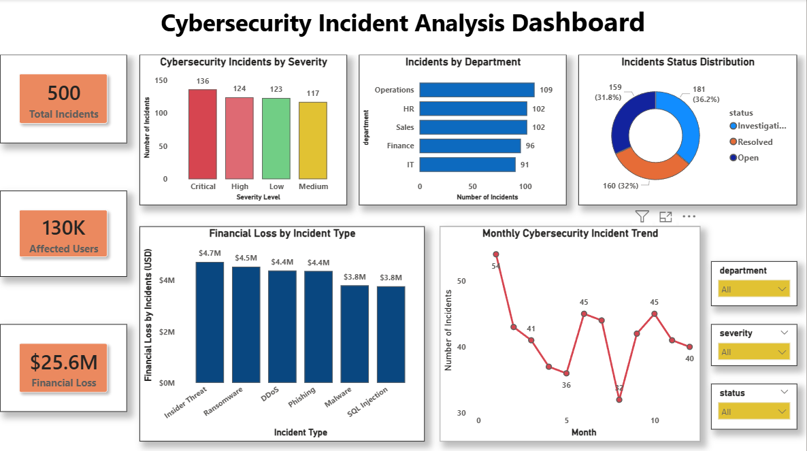

# Cybersecurity Incident Analysis Dashboard

## Project Overview
This project analyzes cybersecurity incidents using Python, SQL, and Power BI.

The objective of this project is to identify:
- Incident severity trends
- Department-wise cybersecurity risks
- Financial impact of cyber attacks
- Monthly incident trends
- Incident resolution status

---

## Tools & Technologies Used
- Python
- Pandas
- NumPy
- Matplotlib
- SQL (SQLite)
- Power BI
- VS Code

---

## Project Structure

```text
cybersecurity-incident-analysis/
│
├── data/
│   └── cybersecurity_incidents.csv
│
├── notebooks/
│   └── cybersecurity_analysis.ipynb
│
├── sql/
│   └── queries.sql
│
├── powerbi/
│   └── cybersecurity_dashboard.pbix
│
├── images/
│   └── dashboard_screenshot.png
│
└── README.md
```

---

## Key Insights

- Critical incidents represented the highest cybersecurity risk category.
- Operations and IT departments experienced the highest number of incidents.
- Insider Threat and Ransomware attacks caused significant financial losses.
- Incident trends fluctuated across months with noticeable spikes in specific periods.
- A large number of incidents remained open or under investigation.

---

## Dashboard Features
- KPI Cards
- Severity Analysis
- Department-wise Incident Analysis
- Monthly Trend Analysis
- Financial Loss Analysis
- Incident Status Distribution
- Interactive Slicers

---

## Dashboard Preview




---

## Author
Nidhishree
